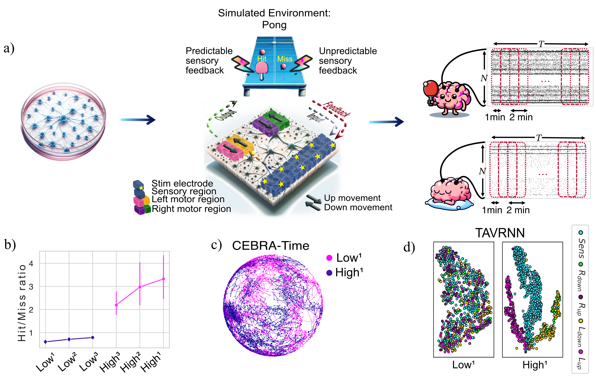
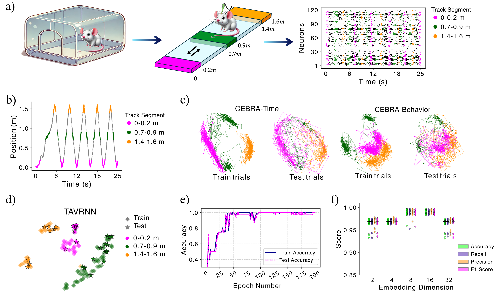
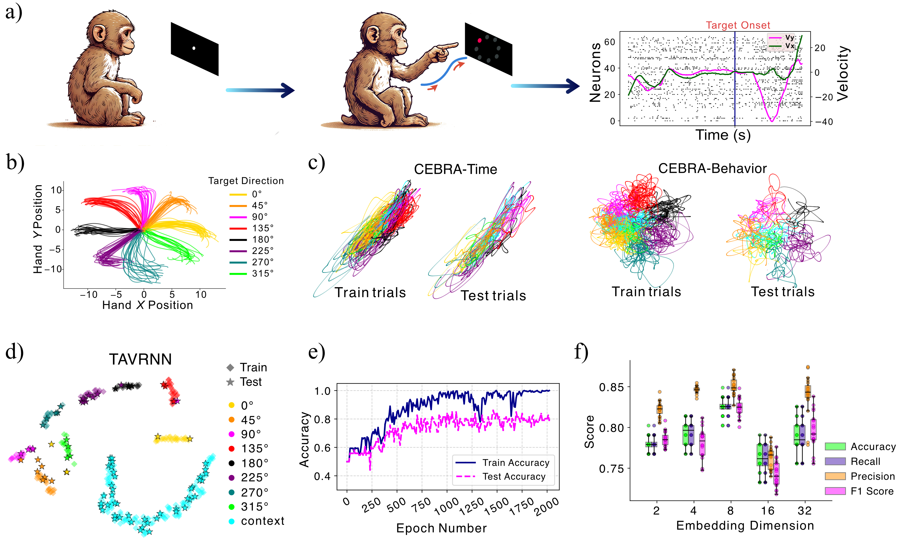
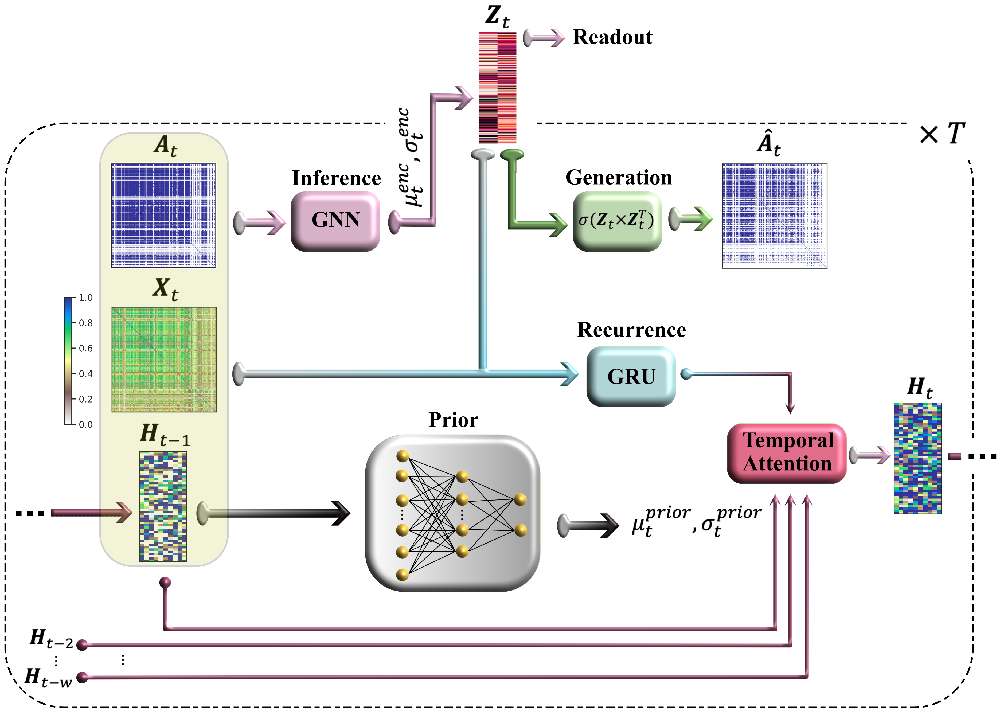

# Temporal Attention-enhanced Variational Graph Recurrent Neural Network

This repository contains the code associated with the paper:

**"TAVRNN: Temporal Attention-enhanced Variational Graph RNN Captures Neural Dynamics and Behavior"**.

## Abstract

We present **TAVRNN** (Temporal Attention-enhanced Variational Graph Recurrent Neural Network), a novel framework designed to analyze the dynamic evolution of neuronal connectivity networks in response to external stimuli and behavioral feedback. TAVRNN models sequential snapshots of neuronal activity, revealing critical connectivity patterns over time. By incorporating temporal attention mechanisms and variational graph methods, the framework identifies how shifts in connectivity align with behavior. We validate TAVRNN using three datasets: in vivo electrophysiological imaging data from freely behaving rats, primate somatosensory cortex electrophysiological recordings during an eight-direction reaching task, and novel in vitro electrophysiological data from the DishBrain system, where biological neurons control a simulated Pong game. TAVRNN surpasses previous models in classification, clustering, and computational efficiency while accurately linking connectivity changes to performance variations. Notably, in the DishBrain dataset, it reveals a correlation between high game performance and the alignment of sensory and motor subregion channels, a relationship not detected by earlier models. This work marks the first dynamic graph representation of electrophysiological data from the DishBrain system, offering key insights into the reorganization of neuronal networks during learning. TAVRNN’s ability to differentiate between neuronal states associated with successful and unsuccessful learning outcomes highlights its potential for real-time monitoring and manipulation of biological neuronal systems.

Schematic illustration of the **DishBrain** feedback loop, game environment, and electrode configurations. Sample spike raster plots from *Gameplay* and *Rest* sessions are shown across \( N = 900 \) electrodes.  
**(b)** Hit/miss ratio for the top three and bottom three performing windows during gameplay, averaged across all cultures.  
**(c)** CEBRA-Time embedded trajectories for the best-performing (**High¹**) and worst-performing (**Low¹**) windows from a sample recording, showing that the two conditions are not distinguishable at the population level in the embedding space.  
**(d)** Low-dimensional representation of neuronal activity for a sample culture using **TAVRNN**, comparing **High¹** and **Low¹** windows. Each point represents a single electrode in the learned embedding space. The embedding dimension was set to 8 for both TAVRNN and CEBRA models, with 2D projections shown here.

<div style="text-align: center;">
    

Schematic of hippocampal data collection from a rat running on a 1.6 m track, with spike activity shown for different track segments.  
**(c–d)** Low-dimensional population embeddings using CEBRA and TAVRNN show separation in train trials but not test trials.  
**(e)** Train/test accuracy over epochs shows convergence for TAVRNN.  
**(f)** TAVRNN performance metrics across embedding dimensions from 20 runs; dim=8 used for all visualizations.
<div style="text-align: center;">
    
</div>

Schematic of primate somatosensory data collection during a target-reaching task, showing hand velocity and movement toward 8 directions.  
**(c–d)** Population embeddings using CEBRA and TAVRNN reveal partial separation across 9 context/movement classes in train and test trials.  
**(e)** TAVRNN train/test accuracy shows convergence.  
**(f)** TAVRNN performance metrics across embedding dimensions from 20 independent runs; dim=8 used for all visualizations.
L
</div>
<div style="text-align: center;">
    
</div>


Below, there is an illustrative shcematic of the TAVRNN pipeline:
<div style="text-align: center;">
    
</div>


## Key Features

- **Temporal Attention Mechanism**: Enhances the model's sensitivity to changes over time by evaluating the similarity of the network’s structure across different time steps.
- **Variational Graph Recurrent Neural Network (VGRNN)**: Captures the complex interplay between network topology and node attributes.
- **Dynamic Graph Representation**: Utilizes zero-lag Pearson correlations to construct network adjacency matrices, representing functional connectivity between neuronal channels.

## Key Comparison Findings

<div style="text-align: center;">
    
</div>


## Repository Structure

- `TAVRNN.ipynb`: Jupyter notebook containing the implementation of the proposed TAVRNN model and analysis.
- `Baselines/DynamicGEM-AE-RNN-AERNN/Baselines Dyn.ipynb`: Jupyter notebook containing the implementation of the baseline methods introduced in Goyal et al. 2018 and Goyal et al. 2020.
- `Baselines/GraphERT/Baseline GraphERT.ipynb`: Jupyter notebook containing the implementation of the beasline methods introduced in Beladev et al. 2023.
- `DataFrames/`: Includes files and data from the DishBrain system recordings

## Running Instructions
To run the method on the external or provided datasets, use the `TAVRNN.ipynb` notebook. Data required to generate the results on the sample DishBrain dataset are included in the DataFrames and the sample data folders of the repository.
The expected runtime of the method on any of the used datasets on a normal desktop computer is less than 10 minutes.

## Requirements

To run the code in this repository, you will need the following packages:


```bash
cebra==0.4.0
matplotlib==3.8.0
networkx==3.1
nilearn==0.10.4
numpy==2.1.1
pandas==2.2.3
plotly==5.9.0
scikit_learn==1.2.2
scipy==1.14.1
seaborn==0.13.2
torch==2.4.1
torch_geometric==2.6.1
torch_scatter==2.1.2
torchvision==0.19.1


